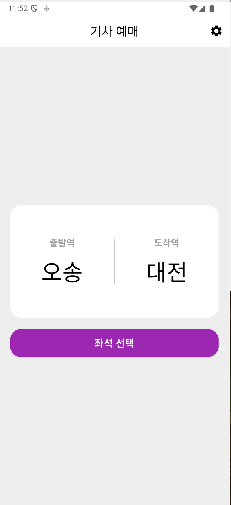
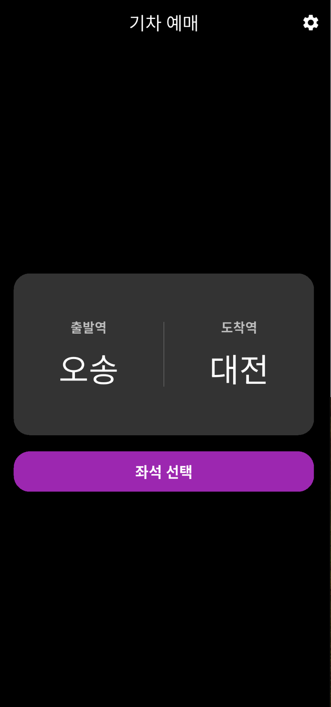
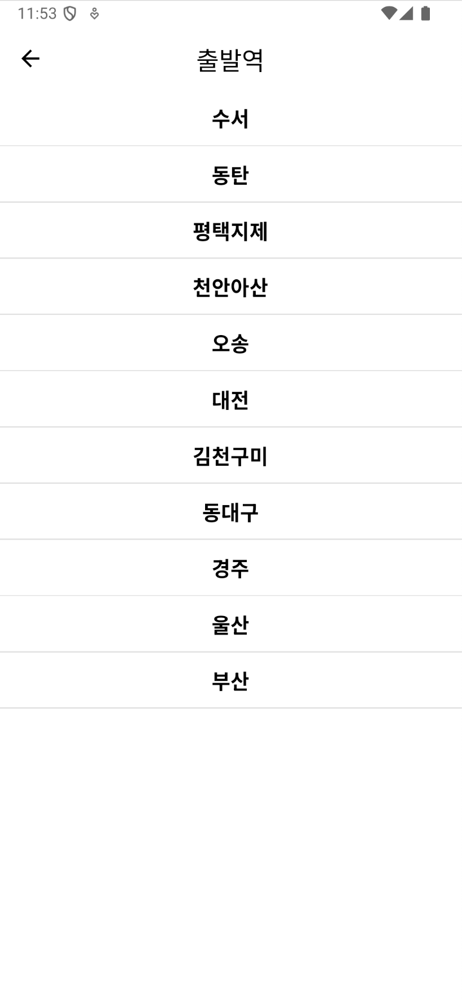
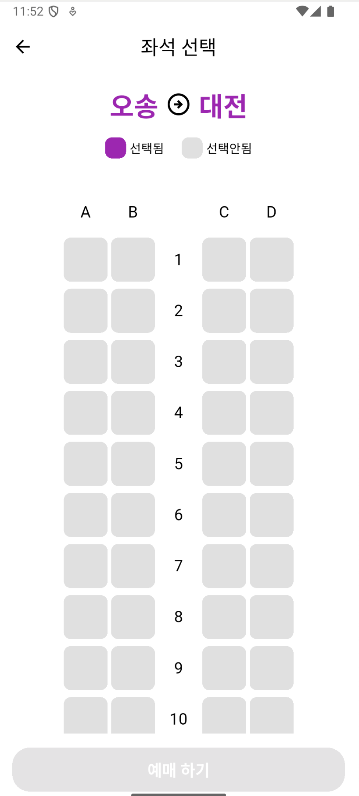

<h1 align="center">
Flutter Train App
</h1>
<p align="center">


## 프로젝트 개요
### "Flutter Train App"은 기차 승객을 위한 간편한 좌석 예매 애플리케이션입니다.

#### 💡 '기차 예매 앱'은 다음과 같은 분들을 위해 탄생되었습니다:

> 🚆 간편하게 기차 좌석을 선택하고 예매하고 싶은 분들
> 

> 🌙 어두운 환경에서도 눈의 피로를 줄이고 싶은 다크 모드 선호 사용자
> 

> 💺 기차 좌석 배치를 시각적으로 확인하며 예매하고 싶은 분들
> 

<br/>

## 개발자 정보

| **현배콩** |
| :------: |

### 프로젝트 일정
2025/3/24 ~ 2025/3/24

## 기술 스택
| 분류 | 기술 |
| --- | --- |
| 프레임워크 |  |
| 언어 |  |
| 상태 관리 |  |
| 디자인 패턴 |  |
| UI 라이브러리 |   |
| 버전 관리 |  |

<br/>

## 앱 스크린샷

| 라이트 모드 홈 화면 | 다크 모드 홈 화면 |
| --- | --- |
|  |  |
| **역 선택 화면** | **좌석 선택 화면** |
|  |  |

<br/>

## 주요 기능

| 홈 화면 | 역 선택 화면 | 좌석 선택 화면 |
| --- | --- | --- |
| - 출발역/도착역 선택<br>- 다크 모드 토글<br>- 직관적인 UI | - 11개 역 목록 표시<br>- 쉬운 역 선택 기능<br>- 이미 선택된 역 필터링 | - 시각적 좌석 배치도<br>- 좌석 선택/취소<br>- 선택된 좌석 강조 표시<br>- 예매 기능 |

<br/>


## 코드 구조
```
lib/
├── main.dart         # 앱 진입점 및 테마 설정
├── pages/            # 화면 구성 요소
│   ├── home_page.dart      # 메인 화면
│   ├── station_list_page.dart  # 역 선택 화면
│   └── seat_page.dart     # 좌석 선택 화면
└── components/       # 재사용 가능한 컴포넌트
    └── (향후 확장 예정)
```

<br/>

## 기술적 의사결정

### 1. Provider를 통한 상태 관리
- **배경**: 앱 전체에서 일관된 테마를 유지하기 위해 상태 관리 솔루션이 필요했습니다.
- **대안**: GetX, Bloc, Redux 등을 고려했습니다.
- **결정**: Provider의 간결함과 직관성, Flutter 공식 문서에서의 권장으로 선택했습니다.
- **결과**: 다크 모드 전환 기능을 간단히 구현했으며, 추후 확장이 용이합니다.

### 2. 좌석 선택 UI 구현 방식
- **배경**: 직관적인 좌석 배치도가 필요했습니다.
- **대안**: GridView, 사용자 정의 위젯 등을 고려했습니다.
- **결정**: Row와 Column을 조합한 유연한 구조로 설계했습니다.
- **결과**: 복잡한 레이아웃에도 불구하고 유지보수가 용이한 코드를 작성했습니다.

### 3. 테마 관리 전략
- **배경**: 다크 모드와 라이트 모드를 모두 지원해야 했습니다.
- **대안**: 각 위젯에서 개별 처리, 중앙 집중식 테마 관리를 고려했습니다.
- **결정**: Flutter의 ThemeData를 활용한 중앙 집중식 테마 관리를 채택했습니다.
- **결과**: 일관된 디자인 경험과 코드 중복 최소화를 달성했습니다.

<br/>

## 트러블슈팅

### 1. 좌석 선택 레이아웃 정렬 문제
- **문제**: 좌석 선택 화면에서 행 번호가 좌석 사이에 정확히 중앙 정렬되지 않았습니다.
- **해결책**: Container와 alignment 속성을 사용하여 텍스트를 정확히 중앙에 배치했습니다.
- **개선점**: 좌석 행과 열의 레이아웃이 다양한 화면 크기에서도 일관되게 표시됩니다.

### 2. 다크 모드에서의 가시성 문제
- **문제**: 다크 모드 전환 시, 일부 UI 요소가 배경과 충분한 대비를 이루지 못했습니다.
- **해결책**: 테마 기반의 조건부 색상 설정과 Color(0xFF444444)와 같은 구체적인 색상 코드를 사용했습니다.
- **개선점**: 다크 모드에서도 모든 텍스트와 아이콘이 명확하게 표시됩니다.

### 3. 좌석 선택 상태 관리
- **문제**: 좌석 선택/취소 시 UI 업데이트가 일관되지 않았습니다.
- **해결책**: Set 자료구조를 사용하여 선택된 좌석의 상태를 관리하고 setState()를 적절히 호출했습니다.
- **개선점**: 좌석 선택 상태가 즉시 반영되며, 중복 선택 문제가 해결되었습니다.

### 4. Cupertino 다이얼로그 버튼 스타일링
- **문제**: iOS 스타일의 다이얼로그 버튼 색상이 디자인 가이드라인과 일치하지 않았습니다.
- **해결책**: isDefaultAction, isDestructiveAction 속성과 textStyle을 조합하여 iOS 네이티브 느낌의 버튼을 구현했습니다.
- **개선점**: 확인 버튼은 파란색, 취소 버튼은 빨간색으로 표시되어 직관적인 사용자 경험을 제공합니다.

### 5. 비활성화된 버튼 스타일
- **문제**: 출발역과 도착역이 선택되지 않았을 때, 비활성화된 버튼이 명확하게 구분되지 않았습니다.
- **해결책**: 비활성화 상태의 버튼에 연한 보라색 톤을 적용하여 시각적 차별화를 구현했습니다.
- **개선점**: 사용자가 버튼의 활성화/비활성화 상태를 쉽게 인식할 수 있게 되었습니다.

<br/>

## 향후 개선 사항

1. **시간표 기능 추가**: 출발 및 도착 시간을 선택할 수 있는 기능
2. **금액 계산 기능**: 선택한 좌석과 거리에 따른 예상 요금 표시
3. **푸시 알림**: 출발 시간 알림 기능
4. **실시간 좌석 현황**: 서버 연동을 통한 실제 좌석 예매 상황 반영
5. **다국어 지원**: 한국어 외에 영어, 중국어 등 다양한 언어 지원

<br/>

## 설치 및 실행 방법

1. Flutter 환경 설정 (Flutter SDK 설치)
```bash
# Flutter SDK 설치 확인
flutter doctor
```

2. 저장소 클론
```bash
git clone https://github.com/hbkong/flutter_train_app.git
cd flutter_train_app
```

3. 의존성 설치
```bash
flutter pub get
```

4. 앱 실행
```bash
flutter run
```

<br/>

## 커밋 컨벤션

본 프로젝트는 아래의 커밋 컨벤션을 따릅니다:

- **feat**: 새로운 기능 추가
- **fix**: 버그 수정
- **docs**: 문서 수정
- **style**: 코드 포맷팅, 세미콜론 누락 등 스타일 관련 변경
- **refactor**: 코드 리팩토링
- **test**: 테스트 코드 추가 또는 수정
- **chore**: 빌드 프로세스 또는 보조 도구 변경
- **build**: 빌드 관련 변경사항

<br/>

## 라이센스

이 프로젝트는 MIT 라이센스 하에 배포됩니다. 자세한 내용은 LICENSE 파일을 참조하세요.
